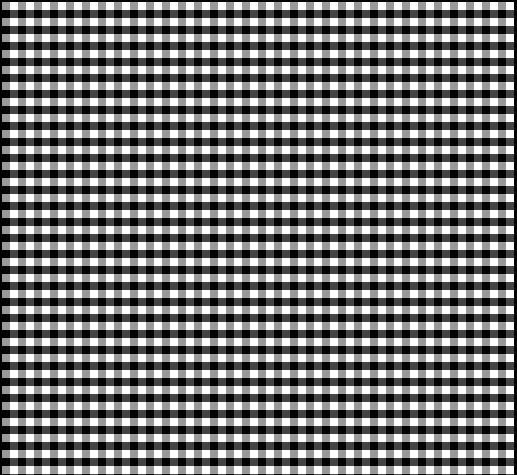

# Gem Gunner

Author: Kenechukwu Echezona

*I'll be speaking as if I finished the game...*

Design (speaking as if I finished): "Gem Gunner" is a danmaku/match-4 hybrid. The player (Carnelian the Bunny) avoids enemy fire while shooting at enemies to turn them into gem bombs, and creating four gems of the same type causes them to explode.

Screen Shot:

I thought I had a pipeline working, but when I open the game, it either crashes or shows this screen...

How Your Asset Pipeline Works:
The asset pipeline loads in the [spritesheet](assets/spritesheet.png) and [palettes](assets/palettes.png).

It starts by creating Tile objects from the spritesheet. My code reads the file in 8-pixel chunks and created "ColoredTile" objects out of them (tiles that hold color information rather than palette index information). Then, it uses those colors to map the colored tiles to a possible palette (a "Palette Bucket", or an array of 4 colors. We assume our sprites are well-formed and can only have at most four colors). I then sort the colors in the Palette Bucket for consistency. Transparent is first and is represented in the sprite with the color 0xeeeeee, followed by the other colors from largest rgba value. I then create the Tile objects using each ColoredTile and the pixel's color index in the Palette Bucket. All the game's tiles fit in the PPU466 at one time. 

The palette portion is a lot simpler: it just goes row by row on my palette sheet (width of 4), with each row being is a palette. Like with the tiles, all palettes fit on the PPU466 at one time.

I had a list of 4 player sprites (which include the cursor and gem star), 20 gem sprites, 12 variable enemy, and 32 bullet sprites. Aside from the player sprite, they also had corresponding game object vectors. Each set had a dedicated portion of the PPU466 Sprite array. Since game logic can keep track of and handle a lot more than 32 bullets at once, I would have utilized sprite flickering and a bullet queue to render more than 32 bullets "at once", with the queue moving along 32 bullets every frame. I was expecting the frame rate to be high enough that the flickering, while probably noticable, would create a translucent effect on the bullets.

How To Play:

The game uses WASD controls: A/D to move Carnelian left and right, W to jump. Use the mouse to aim the Gemstar at enemies, and click to fire, turning the first enemy hit into a Gem Bomb. If four Gem Bombs of the same type are present on the field, they explode, destroying any enemies caught in the explosion. If a fifth Gem Bomb is created (while four have been created and not matched), the oldest one creates a small, short explosion. Gem Bombs can be prematurely destroyed via sustained enemy fire, or by hitting it with the Gemstar.

The goal is to aim for a high score by defeating as many enemies as possible using Gem Bombs; the game ends when Carnelian gets hit twice. The more enemies you defeat with a single chain, the more points you earn per enemy. The Gemstar has a slow rate of fire, so you have to be methodical in who you choose to hit if you want to maximize your score.

Some strategies in how you choose to aim:
- It's best to keep your Gem Bombs far apart to maximize their effective range and in turn the points you earn (Gem Bombs take up 2x2 tile space, but their explosion hit box is 3x3).
- Positioning of the Gem Bombs you create matters, lest you accidentally block your own shots. However, it can also serve as temporary cover from enemy fire, and prematurely detonating your Gem Bomb can help keep you safe in the long run.
- Firing the GemStar at enemies far away keeps you safe from them, and can create more "safe space" between Carnelian and the Gem Bomb, but it also means you have to rely on Carnelian's somewhat slippery movement to evade bullets from enemies nearby. Then again, focusing on enemies that are close means you're not taking advantage of the safety that comes with a ranged attack, so choose wisely.
- Each of the four enemies has different attack patterns, and can be spawned with varying movement and bullet speeds (collectively called "Strength"). If a high-Strength enemy is giving you trouble, it may be worth it to sacrifice your match to defeat a high-Strength enemy and live to earn more points later on.

This game was built with [NEST](NEST.md).

